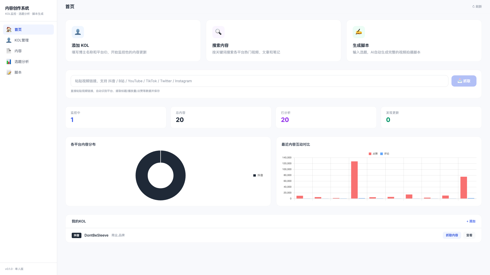
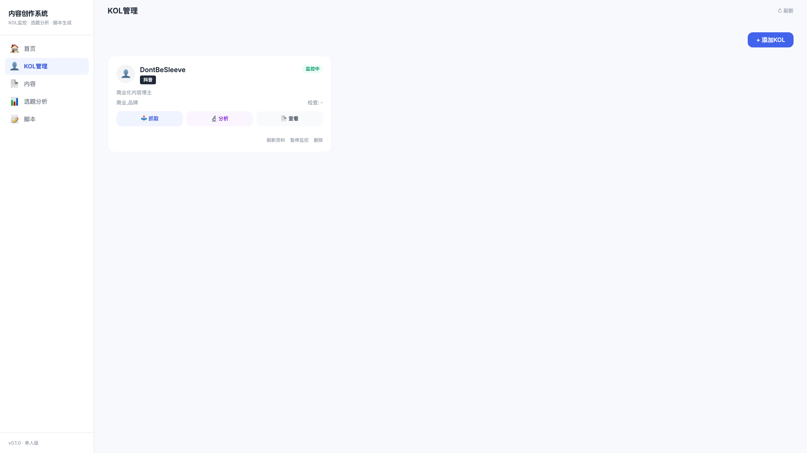
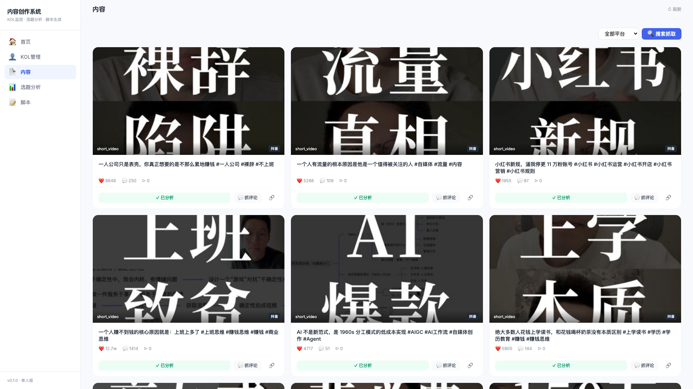
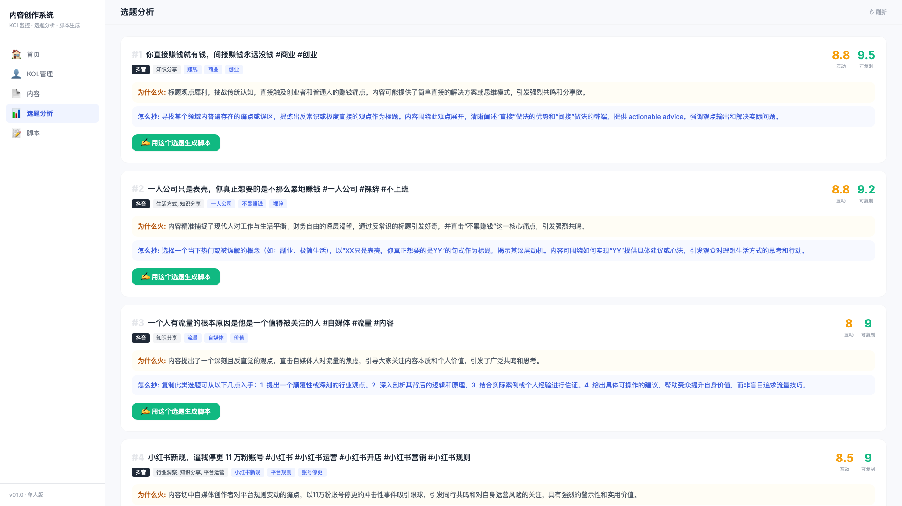
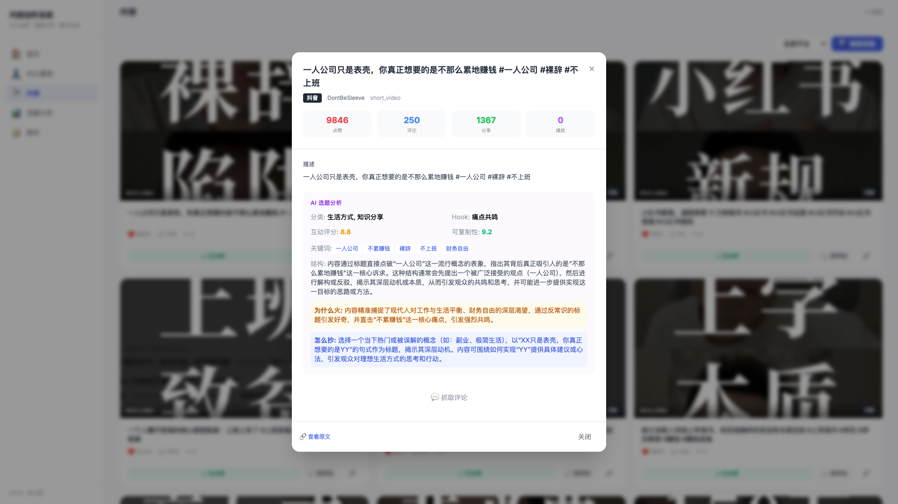

# 内容创作系统 Content Creator Toolkit

多平台 KOL 监控与 AI 选题分析系统。自动抓取主流社交平台的创作者内容数据，通过 AI 深度分析选题策略，帮助内容创作者发现爆款规律、提炼可复制的方法论。



## 核心功能

### 1. 多平台 KOL 监控

添加你关注的博主，系统自动抓取并持续监控他们的最新内容。

**支持平台：**
- 国内：抖音 / B站 / 小红书 / 微博
- 国际：YouTube / Twitter(X) / TikTok / Instagram
- 通用：粘贴任意视频链接，自动识别平台并提取元数据



### 2. 内容数据采集

一键抓取博主的视频/帖子数据，包括标题、描述、封面、点赞数、评论数、转发量、播放量等完整元数据。支持关键词搜索和 URL 直接粘贴抓取。



### 3. AI 选题分析

基于 **Gemini 2.5** 大模型，对抓取的内容进行深度选题分析。



#### 分析维度

**博主画像分析：**
- 博主擅长什么类型的内容
- 视频的"钩子"（Hook）类型是什么（悬念提问 / 数据冲击 / 痛点共鸣 / 反常识…）
- 哪些选题方向数据最好

**多条内容对比分析：**
- 哪些内容爆了，哪些数据一般
- 爆款与普通内容的核心差异
- 互动率评分 & 可复制性评分（0-10）

**实用输出：**
- 「为什么火」— 一句话总结爆款逻辑
- 「怎么抄」— 可直接执行的选题复制建议
- 分析结果支持 **Markdown** 和 **JSON** 格式导出

### 4. 内容详情

点击任一内容卡片，查看完整的元数据和 AI 分析结果。



## 技术栈

| 层 | 技术 |
|---|------|
| 后端 | FastAPI + SQLAlchemy (async) + SQLite |
| 前端 | Vue 3 + Tailwind CSS（单文件 SPA） |
| AI | Gemini 2.5 (通过 OpenAI 兼容接口) |
| 爬虫 | httpx + yt-dlp（多平台） |
| 调度 | APScheduler（自动监控） |

## 快速开始

### 1. 安装依赖

```bash
python3 -m venv .venv
source .venv/bin/activate
pip install -r requirements.txt
```

需要额外安装 yt-dlp（用于 YouTube/Twitter 等国际平台抓取）：

```bash
brew install yt-dlp   # macOS
# 或
pip install yt-dlp
```

### 2. 配置环境变量

复制 `.env.example` 为 `.env` 并填写配置：

```bash
cp .env.example .env
```

关键配置项：

```env
# AI 分析（必填，否则选题分析功能不可用）
OPENAI_API_KEY=你的Gemini API Key
OPENAI_BASE_URL=https://generativelanguage.googleapis.com/v1beta/openai/
OPENAI_MODEL=gemini-2.5-flash

# 平台 Cookie（按需填写，用于对应平台的数据抓取）
DOUYIN_COOKIE=你的抖音Cookie
BILIBILI_COOKIE=
XHS_COOKIE=
WEIBO_COOKIE=
```

> **获取 Gemini API Key：** 前往 [Google AI Studio](https://aistudio.google.com/apikey) 创建免费 API Key。

### 3. 启动服务

```bash
python main.py
```

浏览器访问 `http://localhost:8000` 即可使用。

## 费用说明

> **本系统运行涉及第三方 API 调用费用，请注意：**

- **AI 选题分析**需要消耗 LLM API 额度。当前使用 Gemini 2.5 Flash，Google 提供一定的免费额度，超出后会产生费用。
- 每次分析一条内容约消耗 1K-2K tokens。批量分析多条内容时费用会累积。
- 数据抓取本身不消耗 API 额度。
- 建议在 [Google AI Studio](https://aistudio.google.com/) 监控你的用量。

## 项目结构

```
├── main.py                 # 入口
├── config/settings.py      # 配置
├── api/                    # REST API
│   ├── kol.py             # KOL 管理
│   ├── crawl.py           # 数据抓取
│   ├── content.py         # 内容管理
│   ├── analysis.py        # 选题分析
│   └── monitor.py         # 监控仪表盘
├── core/
│   ├── crawler/           # 多平台爬虫
│   │   ├── douyin.py
│   │   ├── bilibili.py
│   │   ├── xhs.py
│   │   ├── weibo.py
│   │   └── ytdlp_engine.py  # YouTube/Twitter/TikTok/Instagram
│   ├── analyzer/          # AI 分析引擎
│   ├── monitor/           # 自动监控
│   └── scheduler/         # 定时任务
├── storage/               # 数据库模型
├── web/index.html         # 前端（单文件 Vue3 SPA）
└── data/                  # SQLite 数据库 & 导出文件
```

## License

MIT
